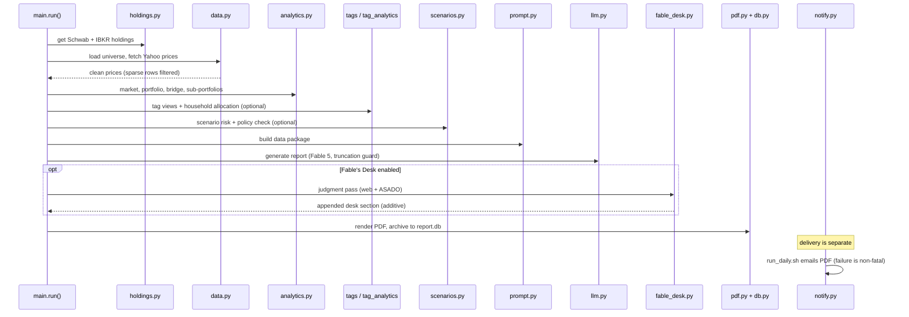

# Unified Report System Architecture

The production path for this repository is the `report/` package. It generates a daily market-and-portfolio report from live holdings, market prices, portfolio analytics, optional tag views, and scenario risk, then turns the result into Markdown, HTML, and PDF while archiving continuity data in SQLite.

## End-to-end flow

`report/main.py` is the orchestrator. In order, it:

1. Ensures directories and database schema exist.
2. Pulls holdings from Schwab and IBKR via `holdings.py`.
3. Loads the ETF universe and fetches batched Yahoo prices via `data.py`.
4. Applies sparse-row filtering so US holiday rows do not poison returns.
5. Computes market, portfolio, bridge, sub-portfolio, tag, allocation, and scenario analytics.
6. Builds the data package and system prompt.
7. Invokes Claude through `llm.py`.
8. Optionally runs Fable's Desk (`fable_desk.py`) — a second Claude pass with live web search and an ASADO country-signal snapshot, producing 0–4 judgment-based ideas persisted to the `desk_ideas` table. Additive-only: any failure logs loudly and the report ships without the section. Gated by `REPORT_ENABLE_FABLE_DESK`.
9. Renders the report to PDF and archives the result through `db.py` and `pdf.py`.

The root README and package README both describe this as the replacement for the older Phase 0 / Step 4 / Phase 2 flow.

End-to-end pipeline: holdings through analytics, LLM report, optional Fable's Desk, render/archive, with email delivery handled outside the main run loop.

## Main modules

### `main.py`
The orchestrator wires all report sections together. Important implementation details:

- `report.main.run()` is the top-level entrypoint.
- It loads the universe before prices so the report only computes market views for universe tickers, while still keeping portfolio-only holdings available for the portfolio sections.
- It computes generic proxy returns for no-daily-mark sleeves such as the Baupost LP and passes them into the allocation and sub-portfolio logic.
- It conditionally computes tier-3 tag views and scenario risk based on settings and data availability.

### `config.py`
Single source of truth for paths, settings, benchmark definitions, look-through data, and manual holdings.

Key concepts in the config layer:

- `PATHS` centralizes all file locations.
- `FACTORS` maps the 15 factor names to Yahoo tickers.
- `BENCHMARK` is the 60/40 ACWI/TLT blend used for tag tilts.
- `FUND_LOOKTHROUGH` captures published composition data for multi-asset and global funds.
- `MANUAL_HOLDINGS` holds off-broker sleeves such as Baupost and private company stakes (Anthropic, Perplexity), carried at fixed value.
- The module loads `.env` early so the rest of the report code can read secrets via environment variables without hardcoding them.

### `data.py`
Responsible for market data acquisition and cleanup.

- `fetch_prices()` downloads a batched daily price matrix from Yahoo Finance. Before the threaded download it calls `_ensure_fd_limit()` to raise the process soft RLIMIT_NOFILE to 8192 — under launchd the default is 256, and yfinance's threaded pull of ~800 tickers exhausts file descriptors, which surfaces as SQLite `unable to open database file` and silently drops most tickers. A bounded retry (3 attempts, exponential backoff) always re-fetches whatever is still missing; the coverage gate (`DataCoverageError` when coverage falls below `SETTINGS['min_coverage']`) only decides whether the run fails, not whether to retry. The retry never early-breaks on sufficient coverage, because that previously stranded live tickers (e.g. VNM, EDEN, EWC, EWD, EWL, EWQ, VBR) at stale closes whenever the first batch already cleared 90%.
- `apply_holding_price_aliases()` creates synthetic price series for held symbols that must inherit a source ticker's return history.
- `filter_sparse_rows()` removes sparse market-holiday rows so daily return calculations use real trading sessions.
- `latest_trading_date()` returns the most recent real session after sparse-row filtering.

### `holdings.py`
Responsible for broker connectivity and fallback behavior.

- Schwab can run with Playwright auto-auth or interactive fallback.
- IBKR can run via Flex Web Service or the TWS subprocess fallback.
- If a broker fails and the run is allowed to continue, the system falls back to the last saved snapshot and marks the run stale.

### `analytics.py`
Houses the report's financial math.

It computes:

- market-level tables and factor views,
- portfolio-level returns, weights, exposures, and alpha inputs,
- sub-portfolio returns for broker/account/grouped sleeves,
- the bridge between market moves and the held book,
- the policy check (see [Market, portfolio, and bridge analytics](../analytics/market-portfolio.md) for details).

The implementation is deliberately fail-loud when benchmark data is missing.

### `tag_analytics.py` and `tags.py`
These modules support the optional tier-3 layer.

- `tags.py` resolves canonical tags, stores them in SQLite, and applies manual overrides where the classifier or source data is known to be wrong.
- `tag_analytics.py` turns those tags into day-type, leadership, bridge, attribution, concentration, and household allocation views.

### `scenarios.py`
This is the standing stress engine. It computes episode-calibrated scenario impacts, crash beta, and a liquidity ladder using the same look-through decomposition as the asset-allocation table.

### `prompt.py`
Builds the data package consumed by the LLM. It is the canonical serialization layer for the report's numbers and labels. It renders the Policy Check, Scenario Risk, and Tag Views sections when their respective data is available (`_render_policy_check`, `_render_scenario_risk`, `_render_tag_views`).

### `llm.py`
Handles the actual model call.

- Claude CLI is the primary path.
- Anthropic SDK streaming is the fallback path.
- Truncated generations are treated as hard failures.
- The Fable path includes server-side refusal fallback to Opus 4.8.

### `pdf.py`
Turns Markdown into HTML and PDF using PrinceXML. It also validates tables so a malformed or truncated report cannot be rendered silently.

### `fable_desk.py`
The judgment-based second pass of the daily report. While the main report is deterministic (numbers-only, no news, no recommendations outside data-triggered Action Box items), the Desk is a second Claude call with live web search (WebSearch/WebFetch) and an ASADO country-signal snapshot. It proposes 0–4 idiosyncratic ideas, each with conviction, horizon, and a falsifiable invalidation. Ideas are persisted to the `desk_ideas` table in `report.db` and graded by the Desk itself on subsequent days (the scorecard).

Key design principles:

- **Additive-only**: any failure logs loudly and the deterministic report ships without the section. The Desk never sinks the report.
- **Fail is fail**: a missing or unparseable `desk-json` machine trailer raises rather than silently losing idea tracking.
- **Pre-validated**: the Desk section is run through the same table-validation check the PDF renderer applies to the full report, so a malformed Desk table rejects only the Desk.
- **Requires Claude CLI**: the Desk is the only path with WebSearch/WebFetch; the API fallback does not carry the Desk.
- Gated by `REPORT_ENABLE_FABLE_DESK` in `config.py` SETTINGS.

### `asado.py`
Builds the ASADO country-signal snapshot that feeds Fable's Desk. It reads from a local DuckDB warehouse (`asado.duckdb`, read-only) and renders a markdown snapshot with:

- a 34-country composite table from `t2_factors_daily` (cross-sectional valuation, long-horizon momentum, RSI, currency, and country-risk z-scores),
- GDELT news tone/attention extremes from `gdelt_factors_daily`,
- best/worst country-selection factors from `factor_returns_daily` over the last 5 sessions.

Any failure (missing DuckDB, missing `duckdb` package, query error) returns `None` with a loud message; the Desk then runs without ASADO data and says so.

### `db.py`
SQLite backing store for:

- `assets`
- `prices`
- `portfolio_snapshots`
- `portfolio_summary`
- `reports`
- `security_names`
- `desk_ideas` — Fable's Desk idea journal (title, action, conviction, horizon, invalidation, status, grade), graded by the Desk itself on subsequent days

The storage layer uses WAL mode, foreign keys, and idempotent upserts.

### `notify.py`
The delivery layer — emails the rendered PDF to the configured recipient. It is invoked by `report/run_daily.sh` after the render/archive step, not from `report.main.run()`, so a delivery failure can never sink a successful report run. It supports macOS Mail.app (AppleScript, zero-config default) and SMTP (when `SMTP_HOST` is set); see [Operations and runbook](../operations/runbook.md) for the environment variables and the scheduled-path failure policy.

## Why this architecture exists

The system is built to make one daily report that is:

- grounded in live holdings and prices,
- reproducible from archived inputs,
- explicit about stale or missing data,
- safe against partial LLM output,
- rich enough to support both human reading and future automation.

The separation between analytics, prompt building, model invocation, and rendering is intentional: each stage has a narrow contract, and the tests focus on the contracts that were historically fragile.

## Change guidance

If you are changing this area, start here:

- orchestration changes: `report/main.py`
- data-source behavior: `report/data.py` and `report/holdings.py`
- math changes: `report/analytics.py` and the tests
- narrative/package changes: `report/prompt.py` and `report/prompts/system.md`
- output rendering: `report/pdf.py`
- model invocation or budget behavior: `report/llm.py`

Watch out for:

- preserving the NO-NA rule,
- keeping benchmark and stale-data handling explicit,
- keeping manual holdings and look-through logic consistent across analytics, prompt generation, and scenario risk,
- updating tests when a report section's contract changes.

## Source references

- `report/main.py`
- `report/config.py`
- `report/data.py`
- `report/holdings.py`
- `report/analytics.py`
- `report/tag_analytics.py`
- `report/tags.py`
- `report/scenarios.py`
- `report/prompt.py`
- `report/llm.py`
- `report/pdf.py`
- `report/db.py`
- `report/prompts/system.md`
